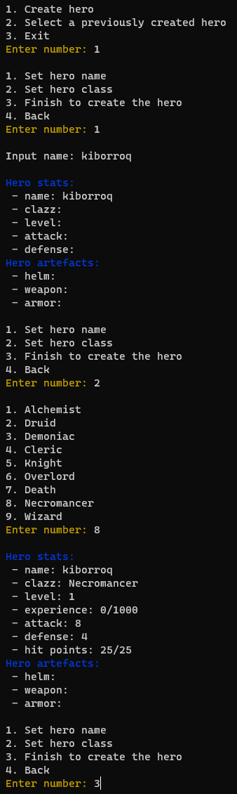
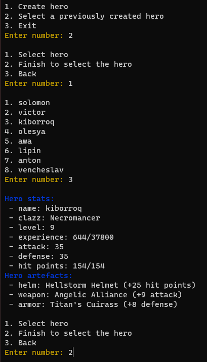
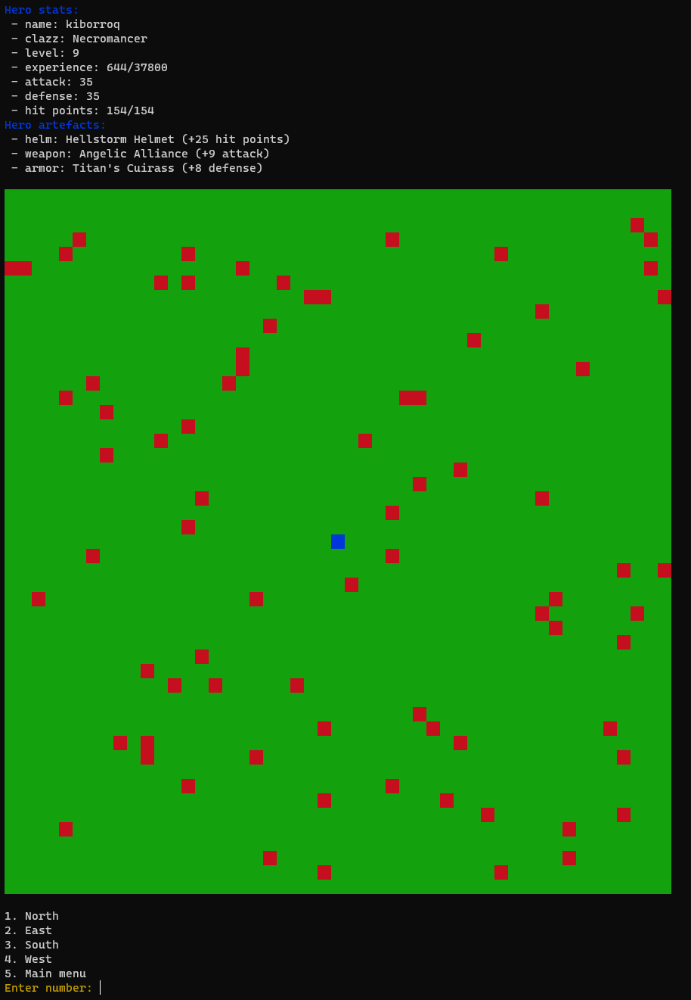
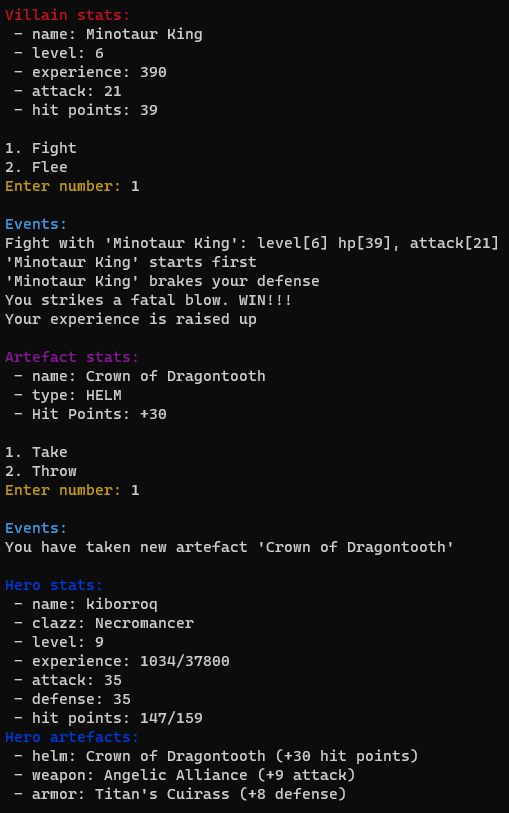
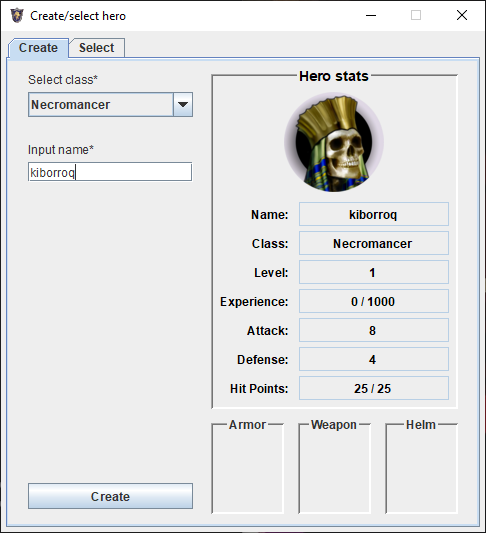
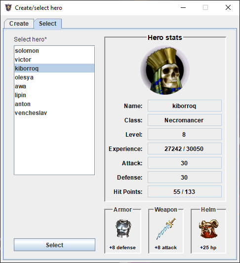
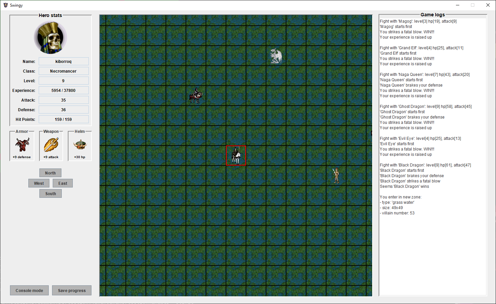
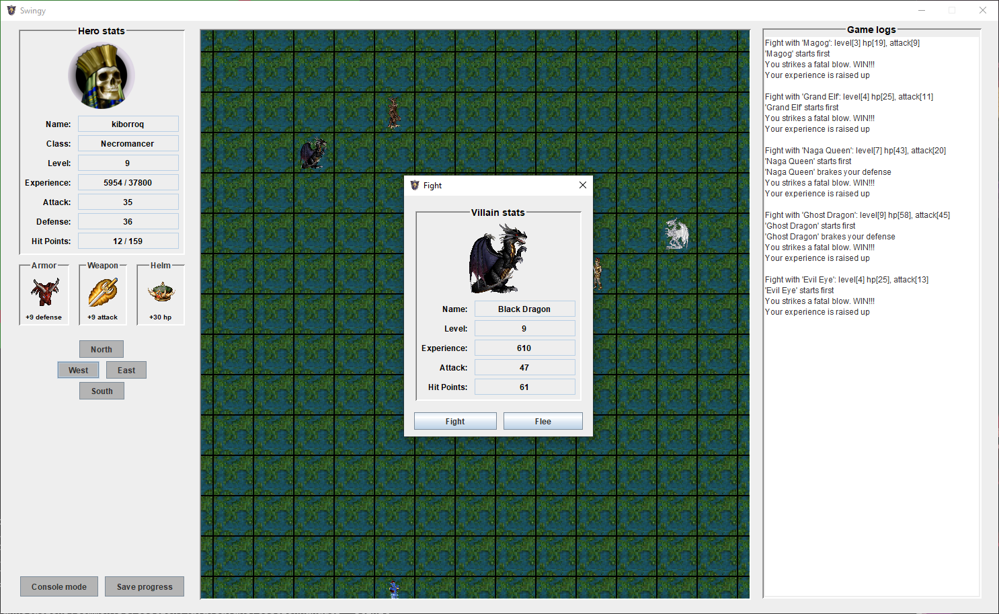
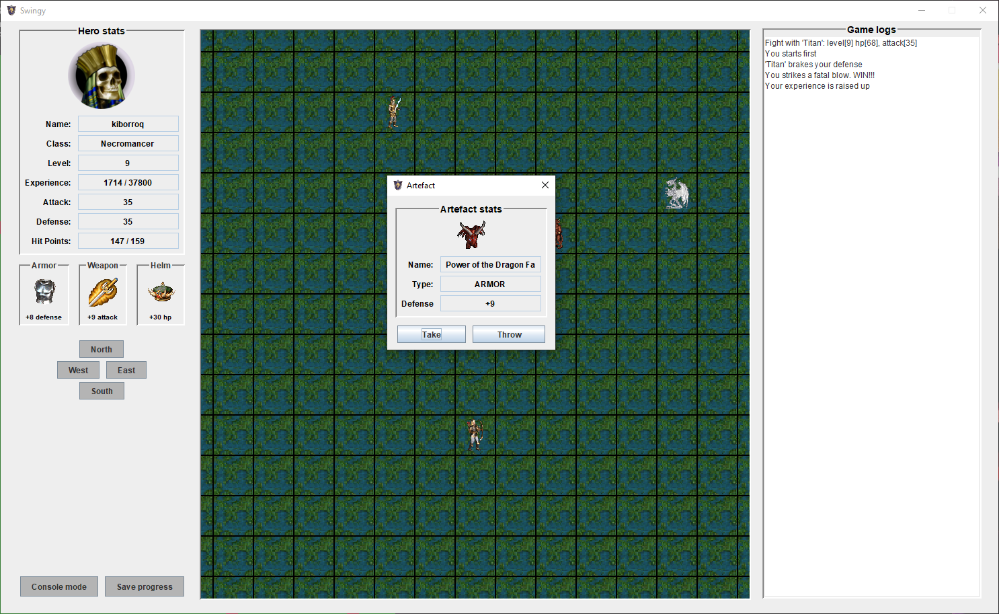

### 1. Application description
Swingy - is a text-based RPG based on the gameplay and conditions described
below. The program needs to follow the Model-View-Controller architecture and allow
switching between the console view and GUI view

#### Main project requirements:
1) Respect the [Model-View-Controller design pattern](https://en.wikipedia.org/wiki/Model%E2%80%93view%E2%80%93controller)
2) Automated build with Maven
3) Annotation based user input validation using [Hibernate validator](https://docs.jboss.org/hibernate/stable/validator/reference/en-US/html_single/#validator-gettingstarted)
4) A user’s heroes and their state will be preserved, when the user exits the game  in a relational database
5) Switch between console view and GUI view at runtime, without closing the
   game

#### Gameplay
When the player starts the game he has 2 options:
- Create a hero
- Select a previously created hero

In either case, the player can see the hero stats:
- Hero name
- Hero class
- Level
- Experience
- Attack
- Defense
- Hit Points
- Artefacts (helm, armor, weapon)

Hero stats are affected by the hero level and artifacts. There are 3 types of artefacts:
- Weapon - increases the attack
- Armor - increases defense
- Helm - increases hit points

After choosing a hero the actual game begins. The hero needs to navigate a square
map with the size calculated by the specific formula: *(level - 1) * 5 + 10 - (level % 2)*

The initial position of the hero is in the center of the map. He wins the game if he
reaches on of the borders of the map. Each turn he can move one position in one of the
4 four directions:
- North
- East
- South
- West

When a map is generated, villains of varying power will be spread randomly over the
map. When a hero moves to a position occupied by a villain, the hero has 2 options:
- Fight, which engages him in a battle with the villain
- Flee (only 50% success probability), if fleeing fails he must fight the villain

If a hero loses a battle, he dies and also looses the mission. If a hero wins a battle, he gains:
- Experience points, based on the villain power. Of course, he will level up if he
  reaches the next level experience.
- An artifact, which he can keep or leave. Of course, winning a battle doesn't guarantee that an artefact will be dropped and the quality of the artefact also varies
  depending on the villain’s strength.

Leveling up is based on the following formula: *level * 1000 + (level - 1) ^ 2 * 450*

---

### 2. Program requirements:
- Maven
- Java 8
- Postgres ([see properties](swingy/src/main/resources/hibernate.properties))

---

### 3. Run program
1) Build executable jar package
```
mvn clean package
```
2) Run app in console or gui mode
```
java -jar swingy-1.0-SNAPSHOT-jar-with-dependencies.jar console
java -jar swingy-1.0-SNAPSHOT-jar-with-dependencies.jar gui
```

---

### 4. Application screens:

#### Console views are present below:
1) Hero create view



2) Hero select view



3) Game view



4) Fight and artefact dialog views




#### GUI views are present below:
1) Hero create view



2) Hero select view



3) Game view



4) Fight dialog view
   


5) Artefact dialog view


6) Artefact dialog view


